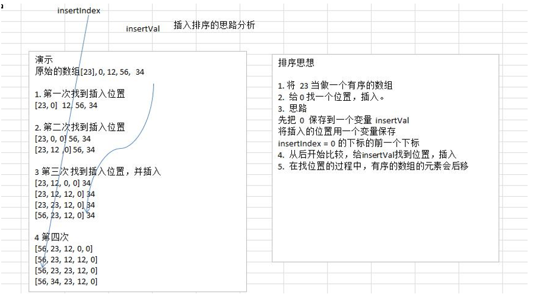

# 九大排序算法总结

## 一.直接插入排序

### 1.动图演示

### 2.代码实现

~~~go
package main

import "fmt"

func main() {

	var arr = []int{20, 19, 5, 13, 89, 56, 23}
	NewArr := InsertionSort(arr)
	fmt.Println(NewArr)

}
func InsertionSort(arr []int) []int {

	for i := 1; i < len(arr); i++ {
		insertval := arr[i]
		insertIndex := i - 1
		for insertIndex >= 0 && arr[insertIndex] < insertval {
			arr[insertIndex+1] = arr[insertIndex]
			insertIndex--
		}
		if insertIndex+1 != i {
			arr[insertIndex+1] = insertval
		}
	}

	return arr
}
~~~

### 3.时间以及空间复杂度

| 平均时间复杂度 | 最好情况 | 最坏情况 | 空间复杂度 | 稳定性 |
| -------------- | -------- | -------- | ---------- | ------ |
| O(n²)          | O(n)     | O(n²)    | O(1)       | 稳定   |

## 二.二分查找插入排序

### 1.代码实现

~~~go
package main

import "fmt"

func main() {
	arr := []int{32, 15, 56, 79, 85, 47, 49}

	//将arr分成无序区和有序区，初始的有序区只有一个元素
	//将i-1分为有序区，将i~len（arr）-1分为无序区
	for i := 1; i < len(arr); i++ {
		index := BinarySearchIndex(arr, i, arr[i])
		temp:=arr[i]
		//这一步和插入排序的逻辑类似
		for j:=i-1;j>=index ;j--  {
			arr[j+1]=arr[j]
			if j==index{
				arr[index]=temp
			}
		}
	}
	fmt.Println(arr)
}

//这一步通过二分查找，查找到对应的插入的下表
func BinarySearchIndex(arr []int, maxIndex int, data int) int {
	begin := 0
	end := maxIndex
	var mid int
	for {
		if begin == end {
			break
		}
		mid = (begin + end) / 2
//重要：解释了为啥是稳定查找，如果插入的数字和中间的数字相同，就放到后面，这是一个稳定的查找
		if arr[mid] > data {
			end--
		} else {
			begin++
		}
	}
	return begin
}
~~~

### 2.时间以及空间复杂度

1.最好情况：查找的位置是有序区的最后一位后面一位，则无须进行后移赋值操作，其比较次数为：log2n  。即O(log2n)

2.最坏情况：查找的位置是有序区的第一个位置，则需要的比较次数为：log2n，需要的赋值操作次数为[n(n-1)/2](http://zhidao.baidu.com/link?url=D1uGyXzk3biP8YR-tKHq1_YHgZZmojMd0XzWlPxSWoYdhaTZdlRyd-FXaVqGNaYpgVHe0Lh3mMKPCwNH2E5C6q)加上 (n-1) 次。即O(n^2)

从实现原理可知，二分查找插入排序是在原输入数组上进行后移赋值操作的（称“就地排序”），所需开辟的辅助空间跟输入数组规模无关，所以空间复杂度为：O(1)

| 平均时间复杂度 | 最好情况 | 最坏情况 | 空间复杂度 | 稳定性 |
| -------------- | -------- | -------- | ---------- | ------ |
| O(n²)          | O(logn)  | O(n²)    | O(1)       | 稳定   |

