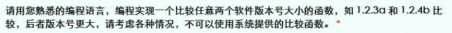
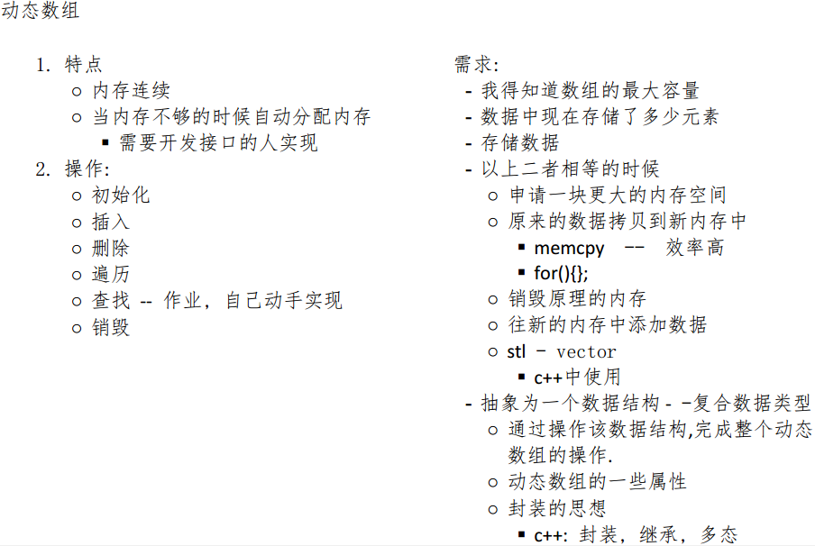
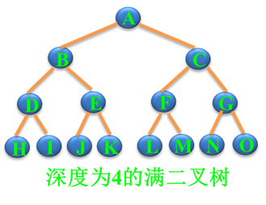
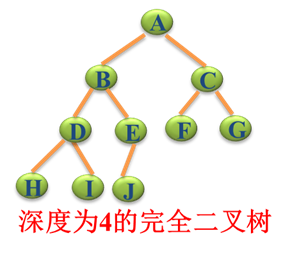
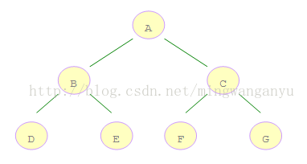
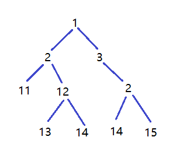

# 数据结构和算法笔记

## 面试题

1. 

   - **思路：**
     - 以 . 为分割线，分割成[]string，版本号格式总是相同，首先验证切片长度是否相同
     - 分割出的字符串切片遍历，并且转成 []byte , 再按照ASCII码分别进行比较
   - **代码：**

   ```go
   package main
   
   import (
   	"strings"
   	"log"
   	"fmt"
   )
   
   func main() {
   	v01 := "1.2.3a"
   	v02 := "1.2.4b"
   
   	strS01 := strings.Split(v01, ".")
   	strS02 := strings.Split(v02, ".")
   
   	if len(strS01) != len(strS02) {
   		log.Panicln("版本号不一致！")
   		return
   	}
   	var byteS01, byteS02 []byte
   
   	resStr:=func() string {
   		for index, _ := range strS01 {
   			byteS01 = []byte(strS01[index])
   			byteS02 = []byte(strS02[index])
   
   			if len(byteS01) > len(byteS02) {
   				fmt.Println("-v01是更高版本")
   			} else if len(byteS01) < len(byteS02) {
   				fmt.Println("-v02是更高版本")
   			} else {
   				res := compare(byteS01, byteS02)
                   //	这一步保证只要出现不同，就可以出结果
   				if res!="两个版本相同"{
   					return res
   				}
   			}
   		}
   		return "两个版本相同"
   	}()
   	fmt.Println(resStr)
   }
   
   func compare(b01, b02 []byte) string {
   	for index, _ := range b01 {
   		if b01[index] > b02[index] {
   			return "=v01是更高版本"
   		} else if b01[index] < b02[index] {
   			return "=v02是更高版本"
   		}
   	}
   	return "两个版本相同"
   }
   ```

2. **给定一个n个数的数组（n <= 10,000,000）,以及一个数字k，请输出：数组中出现最频繁的k个数。如：数组[2,3,1,5,2,1,2,4,3,2,3]， k=3  出现最频繁的数分别是2和3（分别出现3次），其次是1（出现2次）, 所以输出1,2,3这3个数即可，输出顺序随意。**
   答：

   ```go
   
   ```

3. 二叉树
   

   - **思路：**
     - 要想解出此题，必须会定义出二叉树的数据结构
     - 并且要学会遍历二叉树
     - 遍历到叶节点（没有分支的节点称为叶节点）输出结果并且终止

   ```go
   type Node struct {
      num    int
      left  *Node
      right *Node
   }
   
   func (this *Node) PreOrder(n int) {
      if this != nil {
         n = this.num + n
         if this.left == nil && this.right == nil {// 分辨出叶节点的条件
            fmt.Println(n)
            return
         }
         this.left.PreOrder(n)//	通过递归向左遍历
         this.right.PreOrder(n)//	通过递归向右遍历
      }
   }
   func main() {
       //	定义二叉树结构
      node := new(Node)
      node.left = new(Node)
      node.left.left = new(Node)
      node.left.left.left = new(Node)
      node.left.left.right = new(Node)
      node.right = new(Node)
      node.right.left = new(Node)
      node.right.right = new(Node)
      node.right.right.right = new(Node)
      node.num = 5
      node.left.num = 4
      node.left.left.num = 11
      node.left.left.left.num = 7
      node.left.left.right.num = 2
      node.right.num = 8
      node.right.left.num = 13
      node.right.right.num = 4
      node.right.right.right.num = 1
       //	遍历并且得出结果
      node.PreOrder(0)
   }
   ```

   

4. 时间复杂度

   - 程序执行的基本步骤的数量称为时间复杂度 T（步骤数*每步执行的时间）
   - 

5. 大O表示法

   - O(n)表示只能使用一层循环
   - O(n^2)表示使用两层循环
   - 1 < log(n) < n < nlog(n) < n^2 < n^3 < n! < n^n


## 动态数组

先留在这里，回头再来实现……




## 排序

### 冒泡排序

#### 口诀：

- 内层循环将无序区域的数据两两比较，将大的值放在后边，一轮循环下来，最后一个值就是整个无序数据的最大值，最后一个值就成了有序数据；
- 外层循环用来区分有序数据和无序数据，保证内层循环只遍历无序数据。

#### 代码：

```go
func main() {
	arr:=[]int{4,5,7,2,3,57,8,1,34,6,756,1,3,358,4,67,58,3,1,7,3,34,3,6,6}

	//	第一层循环，每循环一次排好一个最大值；这里用 len(arr)-1-i 来控制无序数据
	for i := 0; i < len(arr); i++ {
		//	第二层循环，将无序的部分相邻两两作比较，冒出最大值在最后边
		for j := 0; j < len(arr)-1-i; j++ {
			if arr[j]>arr[j+1]{
				arr[j],arr[j+1] = arr[j+1],arr[j]
			}
		}
	}

	fmt.Println(arr)
}
```


### 插入排序

#### 思想：

1. 外层循环开拓新元素

2. 内层循环，将外层开拓的新元素与已经排序好的元素进行比较

3. 先空出新元素的位置，比新元素大的元素则往后挪一格，直到找到新元素的位置，进行插入

   

#### 代码：

```go
//	版本01,这个版本交换次数太多，其实和冒泡排序原理一样
func main1() {
	arr := NewRamdomArray(10000)
	fmt.Println(arr)
	tStart := time.Now()
    //	第一层遍历
	for i := 0; i < len(arr); i++ {
        //	第二层遍历将前面所有元素都排好序，但是这里的方法多重复值次数有点多，可以优化
		for j := i; j > 0 && arr[j] < arr[j-1]; j-- {
			arr[j], arr[j-1] = arr[j-1], arr[j]
		}
	}
    tEnd := time.Now()

	times := tEnd.Sub(tStart).Seconds()
	fmt.Println(times)

	fmt.Println(arr)
}

//	版本02
func main() {
	arr:=[]int{4,5,7,2,3,57,8,1,34,6,756,1,3,358,4,67,58,3,1,7,3,34,3,6,6}

	fmt.Println(arr)
	//	第一层遍历，开拓疆土
	for i := 0; i < len(arr); i++ {
		var j int
		//	临时变量存储第一层开拓到的新元素
		tem := arr[i]	
		//	第二层遍历，将所有比tem大的元素后移一格，最终找到没有比tem大的元素，再插入
		//	注意: 当不满足for循环的中间条件时，不会进行 j-- 操作
		for j = i; j > 0 && arr[j-1] > tem; j-- {
			//	因为arr[j-1]的值比tem大，所以把它的值移到arr[j]的位置，最开始arr[j]是tem的位置
			arr[j] = arr[j-1]
		}
		//	找到tem的位置，对它进行赋值
		arr[j] = tem
	}
	fmt.Println(arr)
}
```

#### 优势：

1. 若原本的元素已经有顺序，则只进行一次比较，不会有赋值操作，这样对已经有顺序的数据排序就非常快


### 快速排序

#### 思路：

- 分治思想是通过递归调用实现的，停止递归调用的条件就是：数组不能够再拆分
- 分治的详细步骤：
  - 函数传入的三个参数表示自己治理的区域：总数组，最左边的下标，最右边的下标；
  - 将治理区域的最左边的元素提取出来(`tem`)，作为比较基准元素，该元素的位置就成了一个<font color=red>左边</font>坑，在代码中体现为`arr[i]`；
  - 先从最右边开始，若右边元素比`tem`大，略过，并对下标`j`进行相应操作，若找到右边一个元素比`tem`小，则将该元素放入`arr[i]`坑中，`arr[j]`就成了新的<font color=red>右边</font>坑；
  - 再从最左边开始，若左边元素比`tem`小，略过，并对下标`i`进行相应操作，若找到左边一个元素比`tem`大，则将该元素放入`arr[j]`坑中，`arr[i]`就再次成了新的<font color=red>左边</font>坑；
  - 如此循环操作，直到`i>=j`为止，最终将`tem`的值放入`arr[i]`的位置中；
  - 这样将比该元素(`tem`)小的元素放在元素左边，将比该元素大的元素放在右边；
  - 然后以`arr[i]`为中间界限，左右分区治理，直到数组无法再做拆分为止。

#### 代码：

```go
package main

import "fmt"

func QuickSort(arr []int, left, right int) {

	// 递归结束，停止分治的条件，数组不能够在拆分
	if left >= right {
		return
	}
	//	i和j作为移动的下标，i从左边开始，j从右边开始
	i := left
	j := right
	//	将作为基准的元素提取出来，arr[i]作为坑
	tem := arr[i]
    //	不断循环，直到i=j
	for i < j {
		for i < j && arr[j] >= tem {//	遇到右边比tem大的数，跳过
			j--
		}
		if i < j && arr[j] < tem {//	遇到右边比tem小的数，填入坑中，arr[j]称为新的坑
			arr[i] = arr[j]
			i++
		}

		for i < j && arr[i] < tem {
			i++
		}
		if i < j && arr[i] > tem {
			arr[j] = arr[i]
			j--
		}
	}
    //  最后i = j
	arr[i] = tem
    //	分而治之，递归调用
    //	需要注意的是：i的位置已经是确定了的，所以分区治理都不需要包括i
	QuickSort(arr, left, i-1)
	QuickSort(arr, i+1, right)
}

func main() {
	arr:=[]int{4,5,7,2,3,57,8,1,34,6,756,1,3,358,4,67,58,3,1,7,3,34,3,6,6}
	fmt.Println("排序前：",arr)
	QuickSort(arr,0,len(arr)-1)
	fmt.Println("排序后：",arr)
}
```


#### 性能：

- 一万个数据排序：0.0040016 S


### 选择排序

#### 思路：

- 内层循环找出遍历范围内的最小(最大)值，并放在最前；

  - 取最前元素，依次与后面元素进行比较

  - 有更小的元素，则交换两元素的位置

  - 取更小元素再继续与后边的元素比较

  - 一直遍历到末尾，知道找到最小元素，并且在最前面

  - **优化：**

    1. 由于上述步骤，每找到较小元素都要交换元素位置，读写次数太多

    2. 引入一个临时变量用来存储最小元素的位置，每次找到较小元素，只需要用该变量记录位置
    3. 遍历结束后，只需要调换 最前元素 和 临时遍历记录的元素 位置就可以

- 外层循环不断控制内层循环的遍历范围，使得内层循环不再遍历已经有序的数据。

  - **注意：**
    - 外层循环不需要遍历到元素的末尾，只需要遍历到 倒数第二个元素，因为这时末尾元素已经是最大值
    - 内层循环每次都需要遍历到元素末尾（原因不再赘述）


#### 代码：

```go
//	优化前
func selectSort01(arr []int) []int {
	for i := 0; i < len(arr)-1; i++ {
		for j := i+1; j < len(arr); j++ {
			if arr[i] > arr[j] {
				arr[i], arr[j] = arr[j], arr[i]
			}
		}
	}
	return arr
}

//	优化后
func selectSort02(arr []int) []int {
	i:=0
	temIntex:=i
	for ; i < len(arr)-1; i++ {
		for j := i+1; j < len(arr); j++ {
			if arr[temIntex] > arr[j] {
                // 这里只记录下标
				temIntex = j
			}
		}
        // 外层循环一次，只做一次位置调换
		arr[i],arr[temIntex] = arr[temIntex],arr[i]
	}

	return arr
}
```


#### 性能：

1000个数据排序：

- 优化前：0.0039206 S
- 优化后：0.0029854 S


## 查找

### 顺序查找

> 顺序查找不赘述

### 二分查找

#### 局限：

> 只适合对有序数据进行查找


#### 思路：

- 找到数据中点位置的数据，与目标值进行比较；
- 比较过后，过滤掉一半的数据，再取中点数据进行比较；
- 如此循环，直到找到目标数据的位置；
- <font color=red>注意：</font>判断是否继续循环的条件一定要是 `>=或者<=` ，这样可以保证目标值不会因为去小数而略过。


#### 代码：

```go
func binarySearch(arr []int, aim int) int {
	left := 0
	right := len(arr) - 1

    // 这里一定要加上等号
	for left <= right {
		mid := (left + right) / 2
		fmt.Println(arr[mid])

		if aim < arr[mid] {
			right = mid - 1
		} else if aim > arr[mid] {
			left = mid + 1
		} else {
			return mid
		}
	}
    // 返回-1表示没有找到
	return -1
}
```


## 树

### 树的基本概念

1. **度：**表示一棵树 拥有最大分支的节点 的分支数；例如二叉树的度就为 2。
2. **树的深度（或者高度）：**指所有的节点的最大层数（也可以理解为叶节点的层数）。

### 二叉树

#### 二叉树的概念

##### 满二叉树

每个节点都包含两个子节点的二叉树，叶节点除外。



##### 完全二叉树

满足如下两个条件的二叉树称为完全二叉树：

1. 除最后一层外，每一层上的节点数均达到最大值；

   > 也就是说每层的节点数必须是 2^i -1  i 代表层数。

2. 在最后一层上，只缺少右边的若干结点。

   > 一下图为例，最后一层只有三个节点，这三个几点被称为左边节点，如果 节点I 没有了，这棵树就不能称为完全二叉树；如果节点 J 没有了，该数还是完全二叉树。

   

**完全二叉树的特性：**

> 这里后边再补全，堆排序的时候要用到这个特性……


#### 构建二叉树

##### 二叉链表表示法

>  二叉树本质上是由多个分叉的链表组成的数据结构

```go
type Node struct {
	Value   int
    LTag 	bool	// 标记是否有左节点
	LChild  *Node	// 左节点
    RTag 	bool	// 标记是否有右子节点
	RChild  *Node  	// 右节点
}
```

##### 三叉链表表示法

> 增加了父节点指针，当有 从叶节点追溯的根节点 的需求时，使用这种表示方法

```go
type Node struct {
	Value   int
    LTag 	bool	// 标记是否有左节点
	LChild  *Node	// 左节点
    RTag 	bool	// 标记是否有右子节点
	RChild  *Node  	// 右节点
    Parent  *Node 	// 父节点
}
```


##### 生成树的案例

**思路：**

- 将所有节点的数据都准备好，这里的体现是传入的参数 nodes（节点的切片），里面节点的存储顺序是按照前序遍历的顺序存储的，eg：
  
  	nodes 中的节点顺序为：A B D E C F G
- 用 ` LTag RTag ` 标记左右是否有子节点
- 每调用一次 `ConstructTree` 函数，生成一个根节点，当左右都无子节点时，停止递归调用
- 这里的递归调用生成节点的顺序是先生成根节点，再生成左树根节点，只有当无左子树的时候，才开始生成右节点

```go
// 用于遍历nodes的下标，这里也可以作为 ConstructTree 的一个参数传入
var i = 0
func ConstructTree(root *Node, nodes []Node) {
   node := nodes[i]
   i++
   // 当左右都无子节点时，代表它是叶节点，停止递归调用，并将左右子节点赋值为空
   if node.LTag == false && node.RTag == false {
		*root = node
		root.Left = nil
		root.Right = nil
	} else if !node.LTag{
		*root = node
		root.Left = nil
       //	必须要先为左右子节点开辟空间，不然会出现无效地址和空指针的错误
		root.Right = &Hero{}
		ConstructTree(root.Right, nodes)
	}else if !node.RTag{
		*root = node
		root.Right = nil
       //	必须要先为左右子节点开辟空间，不然会出现无效地址和空指针的错误
		root.Left = &Hero{}
		ConstructTree(root.Left, nodes)
	}else{
		*root = node
       //	必须要先为左右子节点开辟空间，不然会出现无效地址和空指针的错误
		root.Left = &Hero{}
		root.Right = &Hero{}
		ConstructTree(root.Left, nodes)
		ConstructTree(root.Right, nodes)
	}
}
```


#### 遍历二叉树

树的遍历是树结构<font color=red>插入、删除、修改、查找和排序</font>运算的前提，是二叉树一切运算的基础和核心。对于以下三种遍历方式，需要知道以下几点（若理解不了，可看完下边代码后再回看这两点）：

1. 三种遍历都遵循一种约定：**对每个结点的查看都是 <font color=red>“先左后右”</font>**；
2. 三种遍历使用的算法是相同的，访问的路径是一样的，只是访问节点 value值 的时机不同。

以这个二叉树为例：


##### 前序遍历

遍历规则是：<font color=red>先根再左再右</font> ，任何子树都需要遵守该规则，除非到了叶节点。

```go
func PreOrder(node *Hero) {
	if node != nil {
		fmt.Printf("no:=%d name=%s\n", node.No, node.Name)
		PreOrder(node.Left)
		PreOrder(node.Right)
	}
}
```

输出结果：`1  2  11  12  13  14  3  2  14  15`


##### 中序遍历

遍历规则是：<font color=red>先左再根再右</font> ，任何子树都需要遵守该规则，除非到了叶节点。

```go
func InfixOrder(node *Hero) {
	if node != nil {
		InfixOrder(node.Left)
		fmt.Printf("no:=%d name=%s\n", node.No, node.Name)
		InfixOrder(node.Right)
	}
}
```

输出结果： `11  2  13  12  14  1  3  14  2  15 `


##### 后序遍历

遍历规则是：<font color=red>先左再右再根</font> ，任何子树都需要遵守该规则，除非到了叶节点。

```go
func PostOrder(node *Hero) {
	if node != nil {
		PostOrder(node.Left)
		PostOrder(node.Right)
		fmt.Printf("no:=%d name=%s\n", node.No, node.Name)
	}
}
```

输出结果： `11  13  14  12  2  14  15  2  3  1 `


#### 计算二叉树叶子结点数目

